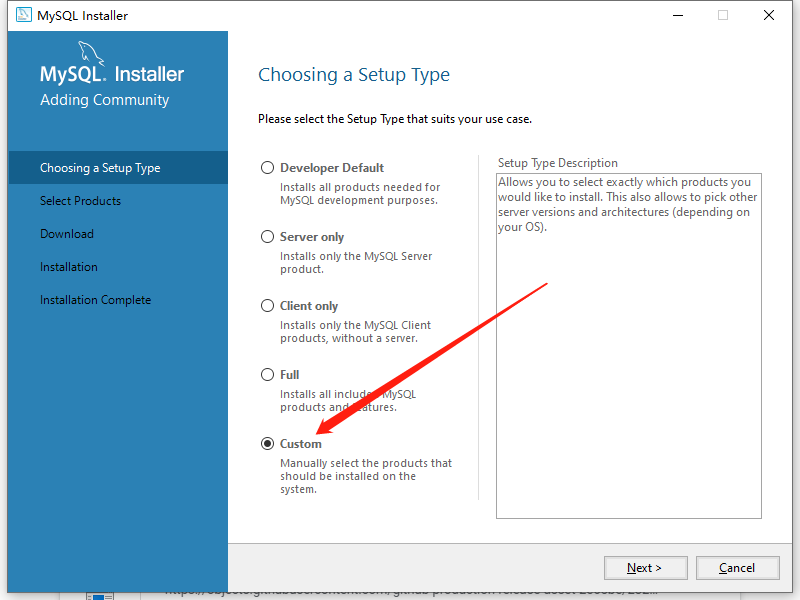

# 4. 配置 Mysql 与注册登录模块

**目录：**

[TOC]

---

## 一、配置 Mysql

Mysql 可以包含多个数据库，每个数据库中可以有多张表，每张表中可以有多个属性（即列），且表中数据按行存储。

### 1.1 下载

Windows 下载地址：[Windows 下载地址](https://dev.mysql.com/downloads/windows/installer/8.0.html)。

Mac、Linux 下载地址：[Mac、Linux 下载地址](https://dev.mysql.com/downloads/mysql/)。

### 1.2 安装




其他页面全选默认即可。

### 1.3 配置环境变量

将 `C:\Program Files\MySQL\MySQL Server 8.0\bin`（如果安装到了其他目录，填写相应目录的地址即可）添加到环境变量 `PATH` 中，这样就可以在任意目录的终端中执行 `mysql` 命令了。

### 1.4 `mysql` 服务的关闭与启动

`mysql` 服务默认开机自动启动，如果想手动操作，可以参考如下命令：
* 关闭：`net stop mysql80`。
* 启动：`net start mysql80`。

### 1.5 `mysql` 的常用操作

**1. 连接数据库服务**

连接用户名为 `root`、密码为 `123456` 的数据库服务：`mysql -uroot -p123456`。

**2. `show databases;`**

列出所有数据库。

**3. `create database kob;`**

创建数据库。

**4. `drop database kob;`**

删除数据库。

**5. `use kob;`**

使用数据库 `kob`。

**6. `show tables;`**

列出当前数据库的所有表。

**7. `create table user(id int, username varchar(100));`**

创建名称为 `user` 的表，表中包含 `id` 和 `username` 两个属性。

**8. `drop table user;`**

删除表。

**9. `insert into user values(1, 'yxc');`**

在表中插入数据。

**10. `select * from user;`**

查询表中所有数据。

**11. `delete from user where id = 2;`**

删除某行数据。

## 二、配置 SpringBoot

> Maven 仓库地址：[Maven 仓库地址](https://mvnrepository.com/)。
> 
> Mybatis-Plus 官网：[Mybatis-Plus 官网](https://baomidou.com/)。

在 `pom.xml` 文件中添加依赖：
* `Spring Boot Starter JDBC`；
* `Project Lombok`；
* `MySQL Connector Java`；
* `mybatis-plus-boot-starter`；
* `mybatis-plus-generator`；
* `spring-boot-starter-security`；
* `jjwt-api`；
* `jjwt-impl`；
* `jjwt-jackson`。

> 注意：
>
> 若出现如下报错：
> ```bash
> org.springframework.beans.factory.BeanDefinitionStoreException: Invalid bean definition with name 'userMapper' defined in file [D:\Learn\King_of_Bots\backend\target\classes\com\kob\backend\mapper\UserMapper.class]: Invalid value type for attribute 'factoryBeanObjectType': java.lang.String
> ```
> 即报错关键词为：
> ```java
> Invalid bean definition with name 'userMapper'
> Invalid value type for attribute 'factoryBeanObjectType': java.lang.String
> ```
> 核心问题在于 Spring Boot 4.0.1 + MyBatis-Plus 3.5.16 不兼容。
>
> 经过数次尝试未果，因此复制 y 总的 `pom.xml` 文件并稍加修改（主要删除了 `spring-boot-starter-security` 相关内容，防止未登录访问任何接口都将会重定向到 `/login`），并将本地的 `pom.xml` 文件整体替换为以下内容：
> ```xml
> <?xml version="1.0" encoding="UTF-8"?>
> <project xmlns="http://maven.apache.org/POM/4.0.0" xmlns:xsi="http://www.w3.org/2001/XMLSchema-instance"
>          xsi:schemaLocation="http://maven.apache.org/POM/4.0.0 https://maven.apache.org/xsd/maven-4.0.0.xsd">
>     <modelVersion>4.0.0</modelVersion>
>     <groupId>com.kob</groupId>
>     <artifactId>backend</artifactId>
>     <version>0.0.1-SNAPSHOT</version>
>     <name>backend</name>
>     <description>backend</description>
> 
>     <properties>
>         <java.version>1.8</java.version>
>         <project.build.sourceEncoding>UTF-8</project.build.sourceEncoding>
>         <project.reporting.outputEncoding>UTF-8</project.reporting.outputEncoding>
>         <spring-boot.version>2.3.7.RELEASE</spring-boot.version>
>     </properties>
> 
>     <dependencies>
>         <dependency>
>             <groupId>org.springframework.boot</groupId>
>             <artifactId>spring-boot-starter-jdbc</artifactId>
>             <version>2.7.1</version>
>         </dependency>
> 
>         <dependency>
>             <groupId>org.projectlombok</groupId>
>             <artifactId>lombok</artifactId>
>             <version>1.18.24</version>
>             <scope>provided</scope>
>         </dependency>
> 
>         <dependency>
>             <groupId>mysql</groupId>
>             <artifactId>mysql-connector-java</artifactId>
>             <version>8.0.29</version>
>         </dependency>
> 
>         <dependency>
>             <groupId>com.baomidou</groupId>
>             <artifactId>mybatis-plus-generator</artifactId>
>             <version>3.5.3</version>
>         </dependency>
> 
> 
>         <dependency>
>             <groupId>com.baomidou</groupId>
>             <artifactId>mybatis-plus-boot-starter</artifactId>
>             <version>3.5.2</version>
>         </dependency>
> 
>         <dependency>
>             <groupId>org.springframework.boot</groupId>
>             <artifactId>spring-boot-starter-thymeleaf</artifactId>
>         </dependency>
>         <dependency>
>             <groupId>org.springframework.boot</groupId>
>             <artifactId>spring-boot-starter-web</artifactId>
>         </dependency>
> 
>         <dependency>
>             <groupId>org.springframework.boot</groupId>
>             <artifactId>spring-boot-starter-test</artifactId>
>             <scope>test</scope>
>             <exclusions>
>                 <exclusion>
>                     <groupId>org.junit.vintage</groupId>
>                     <artifactId>junit-vintage-engine</artifactId>
>                 </exclusion>
>             </exclusions>
>         </dependency>
>     </dependencies>
> 
>     <dependencyManagement>
>         <dependencies>
>             <dependency>
>                 <groupId>org.springframework.boot</groupId>
>                 <artifactId>spring-boot-dependencies</artifactId>
>                 <version>${spring-boot.version}</version>
>                 <type>pom</type>
>                 <scope>import</scope>
>             </dependency>
>         </dependencies>
>     </dependencyManagement>
> 
>     <build>
>         <plugins>
>             <plugin>
>                 <groupId>org.apache.maven.plugins</groupId>
>                 <artifactId>maven-compiler-plugin</artifactId>
>                 <version>3.8.1</version>
>                 <configuration>
>                     <source>1.8</source>
>                     <target>1.8</target>
>                     <encoding>UTF-8</encoding>
>                 </configuration>
>             </plugin>
>             <plugin>
>                 <groupId>org.springframework.boot</groupId>
>                 <artifactId>spring-boot-maven-plugin</artifactId>
>                 <version>2.3.7.RELEASE</version>
>                 <configuration>
>                     <mainClass>com.kob.backend.BackendApplication</mainClass>
>                 </configuration>
>                 <executions>
>                     <execution>
>                         <id>repackage</id>
>                         <goals>
>                             <goal>repackage</goal>
>                         </goals>
>                     </execution>
>                 </executions>
>             </plugin>
>         </plugins>
>     </build>
> 
> </project>
> 
> ```
>
> 在笔者的尝试过程中，删除了旧的 `backend` 项目，创建了新的 `backend` 项目，且为了避免 SpringBoot 与 MyBatis 的版本不兼容问题，特意将 SpringBoot 的版本选择为 3.5.9（非最新版 4.x.x），并将项目的 SDK 配置为 17。
>
> 在上述配置都正确更改后，项目得以顺利运行。但是否为最优配置，仍有待进一步研究，此处暂且略过。

在 `application.properties` 中添加数据库配置：
```properties
spring.datasource.username=root
spring.datasource.password=123456
spring.datasource.url=jdbc:mysql://localhost:3306/kob?serverTimezone=Asia/Shanghai&useUnicode=true&characterEncoding=utf-8
spring.datasource.driver-class-name=com.mysql.cj.jdbc.Driver
```

SpringBoot 中的常用模块：
* `pojo` 层：将数据库中的表（table）对应成 Java 中的 `Class`。
* `mapper` 层（也叫 `Dao` 层）：将 `pojo` 层的 `Class` 中的增删改查操作（crud），映射成 sql 语句。
* `service` 层：实现具体的业务逻辑，组合使用 `mapper` 中的操作。
* `controller` 层：负责请求转发，接受页面过来的参数，传给 `service` 层处理，接到返回值，再传给页面。（即：调度 `service`。）

> 注意：`pojo` 层的上一层即为 Mysql。

## 三、修改 `Spring Security`

实现 `service.impl.UserDetailsServiceImpl` 类，继承自 `UserDetailsService` 接口，用来接入数据库信息。

实现 `config.SecurityConfig` 类，用来实现用户密码的加密存储。

示例代码：
```java
@Configuration
@EnableWebSecurity
public class SecurityConfig {

    @Bean
    public PasswordEncoder passwordEncoder() {
        return new BCryptPasswordEncoder();
    }
}
```

> 注意：
>
> url 可分为公开页面和授权页面，其中公开页面包括 login（登录页面）等页面，授权页面包括 `/`（根页面） 等页面。
> 
> 传统的 session 方式如下。当用户通过公开 login 页面登录时，服务器端将会比对用户输入的 Password 与数据库中存储的 Password，若与数据库一致，则会返回 sessionID；当用户访问授权页面时，浏览器将会判断 sessionID 是否有效，若有效则将 user 提取到上下文，之后则可以访问对应的 Controller。
>
> 目前很多应用为跨域应用，且很多应用不仅只有一个端，因此 session 方式较难使用。为了解决跨域问题，一种流行的替代方式为 Jwt 验证。
>
> Jwt 验证的优势在于：其一，Jwt 可以解决跨域问题；其二，Jwt 不需要在服务器端存储。
>
> 使用 Jwt 验证方式时，用户在登录成功后，服务器将会返回一个 jwt-token，且 jwt-token 完全存储在用户端。

实现 [`utils.JwtUtil` 类](https://www.acwing.com/blog/content/23255/)，为 `jwt` 工具类，用来创建、解析 `jwt token`。

实现 [`config.filter.JwtAuthenticationTokenFilter` 类](https://www.acwing.com/blog/content/23256/)，用来验证 `jwt token`，如果验证成功，则将 `User` 信息注入上下文中。

配置 [`config.SecurityConfig` 类](https://www.acwing.com/blog/content/23257/)，放行登录、注册等接口。

## 四、编写 API

将数据库中的 `id` 域变为自增：
* 在数据库中将 `id` 列变为自增。
* 在 `pojo.User` 类中添加注解：`@TableId(type = IdType.AUTO)`。

实现 `/user/account/token/`：验证用户名密码，验证成功后返回 `jwt token`（令牌）。

实现 `/user/account/info/`：根据令牌返回用户信息。

实现 `/user/account/register/`：注册账号。